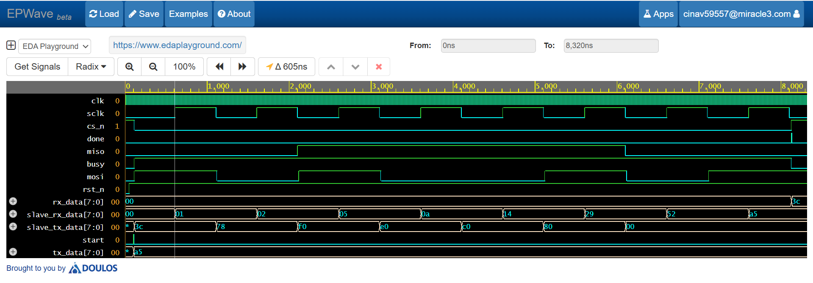
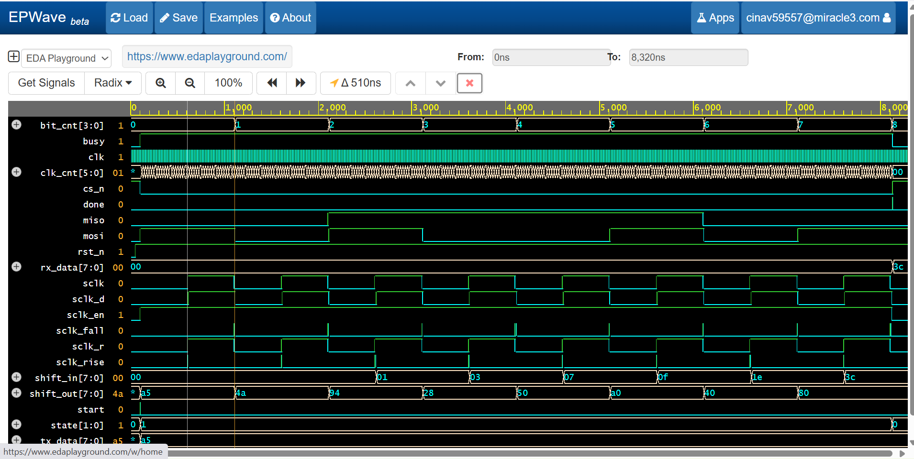

# SPI (Serial Peripheral Interface) - Master (Mode 0)

# Overview
This project implements an "SPI Master" using Verilog HDL operating in "SPI Mode 0 (CPOL = 0, CPHA = 0)".
The design supports full-duplex communication between the SPI Master and a simulated SPI Slave through a Verilog testbench.
The functionality has been verified using simulation and waveform analysis in EDA Playground.

# Features
- SPI Mode 0 (CPOL = 0, CPHA = 0)
- Full-duplex communication
- Parameterized data width
- Configurable SPI clock divider (100MHZ / 2*50) => 1MHz
- FSM-based controller
- MSB-first data transmission
- Waveform verification using simulation (EDA Playground)

# Project Files
SPI/
├── spi_master.v      
├── spi_tb.v        
├── waveform.png      
└── README.md

# SPI Timing
- SCLK Idle State : LOW
- Data is sampled on the Rising Edge.
- Data changes on the Falling Edge.
- Rising Edge   -> Sample Data
- Falling Edge  -> Shift/Change Data

# What I Learned
During this project, I learned:

- Fundamentals of the SPI communication protocol.
- Difference between CPOL and CPHA.
- SPI Mode 0 timing.
- Full-duplex communication.
- FSM-based SPI Master design.
- Clock divider implementation for generating SPI clock.
- Shift register based data transmission and reception.
- Edge detection using rising and falling edges.
- Verilog RTL design and simulation.
- Waveform analysis using EDA Playground.

# Waveform Analysis
The simulation waveform confirms that:

- CS goes LOW before communication starts.
- SCLK toggles only during data transfer.
- MOSI changes on the Raising edge.  (for slave) receive - sample input on the rising edge.
- MISO changes on the falling edge.  (for slave) transmit - change output on the falling edge.
- Both Master and Slave sample data on the rising edge.
- Busy signal remains HIGH during transfer.
- Done signal is asserted after completion.
- The received data exactly matches the transmitted data.

# Simulation Result

| Master Sent | Slave Received | Slave Sent | Master Received |
|    0xA5     |      0xA5      |    0x3C    |      0x3C       |

The transmitted and received data matched successfully.

# Simulation Waveform

